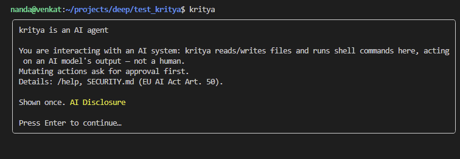
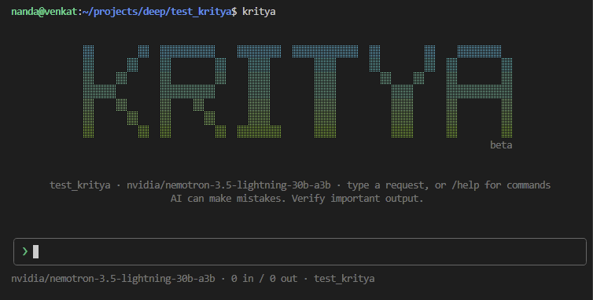
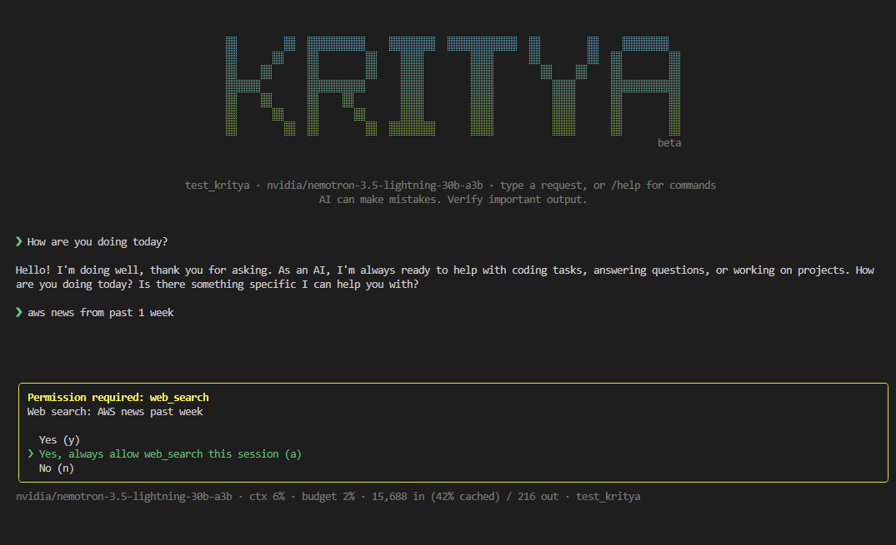
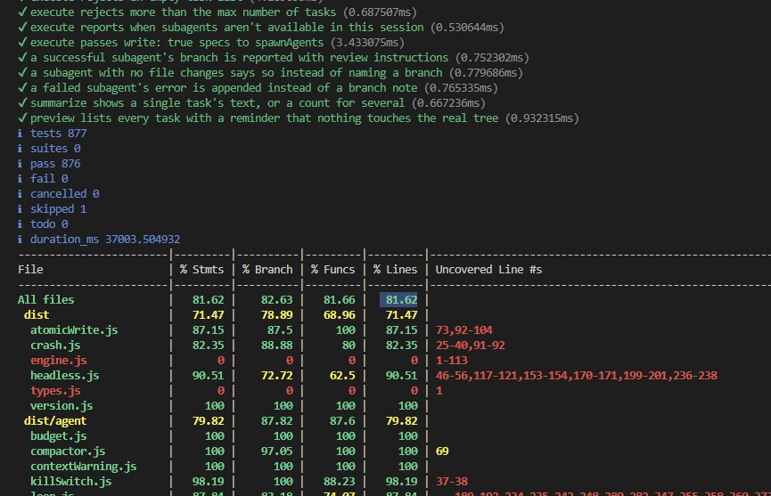

# kritya

[](https://github.com/GenAICloudDevOps/Kritya/actions/workflows/ci.yml)
[](https://www.npmjs.com/package/kritya)
[](LICENSE)
[](https://socket.dev/npm/package/kritya)

Dependency risk is scanned on [Socket](https://socket.dev/npm/package/kritya);
see [SECURITY.md](SECURITY.md#dependency-scanning) for how flagged findings
are triaged.

> ⚠️ **Beta** — APIs, flags, and behavior may still change between releases.

Open source, [MIT licensed](LICENSE).

A lean, interctive coding agent for your terminal. Provider-agnostic —
it works with any OpenAI-compatible endpoint: [build.nvidia.com](https://build.nvidia.com)
(Qwen3 Coder, Kimi K3, DeepSeek, GLM, Nemotron, ...) by default, plus OpenAI,
OpenRouter, Groq, DeepSeek, Mistral, Together, and local models via Ollama.

Works on Linux, macOS, and Windows.

Configured for OpenAI-compatible endpoint - used with build.nvidia.com; other
providers are wired the same way but not exercised.

```
cd your-project
kritya .
```

The agent can read, write, and edit files, search code, and run shell commands —
autonomously looping until your request is done. Anything that mutates state
(writes, edits, shell commands) asks for your permission first.

## Features

- **Provider-agnostic** — OpenAI-compatible endpoint (NVIDIA, OpenAI,
  OpenRouter, Groq, DeepSeek, Mistral, Together, Ollama, ...); tested with
  NVIDIA only
- **Permission-gated actions** — every file write/edit/shell command asks
  first, with configurable allow/deny rules
- **Sandboxed execution** — OS-enforced backstop (`bwrap`/`sandbox-exec`)
  confining writes to the workspace; falls back to unsandboxed (with a
  warning) if the sandbox binary isn't installed
- **Staged project workflow** — `/flow-brainstorm → spec → plan → build →
review → fix` for building something new end-to-end
- **MCP + Agent Plugins support** — extend with external tools/servers, each
  individually trust-gated
- **Undo/redo/checkpoints** — revert or rewind file changes and conversation
  state
- **Office docs & notebooks** — read/write Word, Excel, PowerPoint, PDF,
  Jupyter
  - **Headless/CI mode** — scriptable, no-TTY runs for automation
  - **Privacy mode** — `--privacy`, `KRITYA_PRIVACY=1`, or `"privacyMode": true` disables transcript, audit, and telemetry persistence

## Setup

Requires Node.js >=22.

1. Get an API key from your chosen provider (click any
   model → "Get API Key").
2. Set it (any one of these):
   - Put `NVIDIA_API_KEY=nvapi-...` in a `.env` file — checked in the workspace
     you launch in, the directory you run from, and `~/.kritya/.env`
   - Linux/macOS: `export NVIDIA_API_KEY=nvapi-...`
   - Windows: `setx NVIDIA_API_KEY nvapi-...` (then open a new terminal)

   Optional: add `TAVILY_API_KEY` the same way to enable the agent's
   web-search tool (`/web-search`) — get one at [tavily.com](https://tavily.com).

   Optional (Linux): install `bubblewrap` (`bwrap`) for OS-level command
   sandboxing — macOS has its sandbox built in; without `bwrap`, Linux falls
   back to running commands unsandboxed with a warning.

3. Install and run — pick one:

```bash
# Option A: npm
npm install -g kritya@beta
cd ~/some-project
kritya               # enter
```

```bash
# Option B: from source
git clone https://github.com/GenAICloudDevOps/Kritya.git
cd Kritya
npm install
npm run build
npm link           # puts `kritya` on your PATH
cd ~/some-project
kritya               # enter
```

## Screenshots

**One-time AI disclosure notice on first launch**



**Startup banner with model and workspace status**



**Permission prompt for a web search request**



**Command list shown after typing `/`**


**Test suite and coverage output**



## Usage

```
kritya [directory] [options]

  -c, --continue        resume the most recent session for this directory
  -r, --resume          pick a past session from a list
  -m, --model <id>      use any model ID your provider offers
  -p, --provider <name> nvidia (default), openai, openrouter, groq, deepseek,
                        mistral, together, ollama, switchyard (multi-model
                        routing via NVIDIA NeMo Switchyard), or a custom one
  -h, --help            help
  -v, --version         version
```

In-session commands (type `/` to see them with autocomplete; letters filter the list):

| Command                   | What it does                                                                                                                        |
| ------------------------- | ----------------------------------------------------------------------------------------------------------------------------------- |
| `/model`                  | interactive model picker (`/model <id>` sets any model ID directly)                                                                 |
| `/provider`               | list providers, or `/provider <name>` to switch mid-session ([more](docs/CONFIGURATION.md#providers))                               |
| `/flow-brainstorm <idea>` | start the staged new-project workflow (see below)                                                                                   |
| `/flow-spec`              | project workflow: write the spec from the approved brainstorm                                                                       |
| `/flow-plan`              | project workflow: plan from the spec (read-only)                                                                                    |
| `/flow-build`             | project workflow: implement the plan, with tests                                                                                    |
| `/flow-review`            | project workflow: spec-compliance and security review of the build                                                                  |
| `/flow-fix`               | project workflow: fix the review's findings, each one re-verified                                                                   |
| `/plan`                   | toggle plan mode: `/plan`, `/plan on`, `/plan off` (unrelated to `/flow-plan`)                                                      |
| `/project`                | workflow status; `goto <phase>`, `rename <name>`, `clear` to end it                                                                 |
| `/diff`                   | show the cumulative git diff of this session's changes                                                                              |
| `/init`                   | scan the repo and generate a `KRITYA.md` project-memory file                                                                        |
| `/commit`                 | have the agent review, stage, and commit the current git changes                                                                    |
| `/web-search <query>`     | search the web via Tavily; results are shown and added to context                                                                   |
| `/mcp`                    | MCP server status; `/mcp add\|remove <name>`, `/mcp login\|logout <name>`, `/mcp trust` ([more](docs/CONFIGURATION.md#mcp-servers)) |
| `/skills`                 | list discovered skills (project + user-global) and why any were skipped                                                             |
| `/plugins`                | list discovered Agent Plugins, what each contributes, and why any were skipped ([more](docs/CONFIGURATION.md#agent-plugins))        |
| `/undo`                   | revert all file changes from the agent's last turn                                                                                  |
| `/redo`                   | reapply the change most recently undone                                                                                             |
| `/checkpoint <name>`      | save a named point in the session (`/checkpoint` alone lists saved ones)                                                            |
| `/rewind <name>`          | rewind both the conversation and the files to a checkpoint                                                                          |
| `/compact`                | summarize older conversation to free context space                                                                                  |
| `/clear`                  | start a fresh conversation                                                                                                          |
| `/cost`                   | token usage and estimated $ (see Pricing below)                                                                                     |
| `/audit`                  | show this session's permission decisions and verify the audit log's chain ([more](docs/CONFIGURATION.md#audit-log--telemetry))      |
| `/budget`                 | show session token budget; `/budget reset` or `/budget <number>`                                                                    |
| `/kill`                   | emergency stop: `/kill [reason]` halts everything; `/kill off` releases                                                             |
| `/help`                   | command list                                                                                                                        |
| `/exit`                   | quit                                                                                                                                |

Custom `/commands` you define (see [docs/CONFIGURATION.md](docs/CONFIGURATION.md#custom-slash-commands)) also appear here.

`Esc` cancels a running request. `↑/↓` recalls input history. `Ctrl+O` toggles
full tool output. `Ctrl+K` is the kill switch (see below). `Ctrl+C` exits.

### More features

- **Staged new-project workflow** — ask kritya to build something new (a
  FastAPI backend, a Next.js frontend, a CLI) and it doesn't dive straight into
  code. It runs six phases — **brainstorm → spec → plan → build → review → fix**
  — writing a durable artifact for each under `docs/<name>/` and stopping for
  your approval between phases:

  | Phase        | Produces                                                                                                                                                                                        |
  | ------------ | ----------------------------------------------------------------------------------------------------------------------------------------------------------------------------------------------- |
  | `brainstorm` | `brainstorm.md` — problem, users, MVP features, stack                                                                                                                                           |
  | `spec`       | `spec.md` — contracts, data schema, acceptance criteria (MUST/LATER), and non-functional requirements (security/reliability/performance/CI, asked about via `ask_user` — skipped if none apply) |
  | `plan`       | `plan.md` — architecture and ordered milestones, each tagged RISKY or ROUTINE, plus trust boundaries for any security/reliability requirement                                                   |
  | `build`      | the code, with tests written before the code they test, plus negative/failure-path tests for security/reliability-tagged milestones, and a live milestone checklist                             |
  | `review`     | `review.md` — a one-line scorecard, then spec-compliance, security, and reliability findings                                                                                                    |
  | `fix`        | `fix.md` — the review's findings addressed and re-verified                                                                                                                                      |

  Spec comes before plan on purpose: the spec settles _what_ (and pins the
  numbered acceptance criteria everything downstream is held to), the plan
  settles _how_ and sequences milestones against those criteria. Each phase
  reads only the artifact immediately before it, so nothing gets re-derived.
  The current phase lives in `.kritya/project.json`, so the flow resumes across
  sessions. While a workflow is active the statusline carries a `⚑ name:phase`
  flag, and the spinner names the running phase; `/project` shows the full
  picture — including a warning if an earlier artifact was edited after a
  later one already depended on it — and `/project clear` ends it. A phase
  refuses to run if the artifact it reads was never written (`--force`
  overrides). The agent walks the phases on its own, or you drive them by hand
  with `/flow-brainstorm <idea>`, `/flow-spec`, `/flow-plan`, `/flow-build`,
  `/flow-review`, `/flow-fix` — and after each one kritya tells you which
  command comes next, so the handoff doesn't depend on the model remembering
  to say it. `/flow-fix` only fixes what review found; if anything is still
  open afterward it tells you to run `/flow-review` again or `/flow-fix`
  again once you've decided how to handle what's left.

  The project is named from your idea unless you name it yourself with a short
  prefix — `/flow-brainstorm reverser: a script that reverses a string` gives
  you `docs/reverser/`. `/project rename <name>` moves an existing one.

  Cost matters here — six phases in one session adds up — so kritya compacts
  the conversation at each phase boundary (the artifact is on disk, so the
  transcript that produced it is redundant), caps artifact length, and in the
  build phase dispatches independent milestones to isolated write subagents
  rather than pulling every file into the main context. The review phase runs
  its two reviewers as read-only subagents, so only their findings come back;
  the fix phase does the same to re-verify only what it changed.

  In the plan phase, plan mode's read-only guard is relaxed just enough to let
  the agent write Markdown under that project's own `docs/<name>/` folder —
  other docs, application code, and shell stay blocked until you `/flow-build`.
  Plan mode itself is still a separate, general-purpose toggle — `/plan`,
  `/plan on`, `/plan off` — unrelated to the workflow's `/flow-plan` phase.

- **Trust levels** — `Shift+Tab` cycles **normal** (every write/edit asks
  first) → **accept-edits** (file writes/edits auto-approve, no prompt) →
  **plan** (read-only, nothing executes) → back to normal. The statusline
  always shows which one you're in, with a running `(N auto-approved)` count
  in accept-edits mode so you know how much slipped through before checking
  `/diff`. Destructive shell commands (`rm -rf`, force-push, etc.) always
  still prompt, in every mode — that guard never turns off. The first time you
  switch into accept-edits mode each session, kritya asks you to confirm first
  so it's a deliberate choice, not an accidental keypress. `/plan on` and
  `/plan off` set the mode explicitly; a bare `/plan` toggles it. `/plan` never
  touches the project workflow — that's `/flow-plan`.
- **Kill switch** — `Ctrl+K` (or `/kill [reason]`) is a hard stop for the whole
  session. It aborts the in-flight model stream, any running tool, and every
  subagent at once, then refuses everything afterwards: new messages, tool
  calls, compaction, and any slash command that would drive the agent all come
  back with `⛔ Kill switch ACTIVE` until you run `/kill off`. Unlike `Esc`
  (which cancels one turn) it outranks every other mode — plan mode,
  accept-edits, and allow rules cannot get a tool past it — and it works from
  anywhere, including while a permission prompt is on screen. The statusline
  shows `⛔ KILLED`, and both the stop and the release are written to the audit
  log. It's session-only: restarting kritya comes up in the normal state.
  Some terminals steal `Ctrl+K` for their own shortcuts before kritya ever
  sees it — VS Code's integrated terminal is the common case, where it's
  bound as a chord prefix. `/kill [reason]` always works there instead; to
  get `Ctrl+K` itself working, add a `terminalFocus`-scoped override to VS
  Code's `keybindings.json`:
  ```json
  {
    "key": "ctrl+k",
    "command": "workbench.action.terminal.sendSequence",
    "args": { "text": "\u000b" },
    "when": "terminalFocus"
  }
  ```
- **Subagents** — the agent can dispatch one or more focused investigations to
  fresh contexts at once (`spawn_agent`), each returning only its findings —
  keeps the main conversation lean on big searches. It can also dispatch
  **write-capable subagents** (`spawn_write_agent`) for independent chunks of
  work that can proceed in parallel; each one is isolated on its own git
  branch/worktree, so its edits and shell commands never touch your real
  working tree — review the diff and merge the branch yourself when ready.
  Destructive commands (`rm -rf`, force push, etc.) are always blocked inside
  a write subagent, since there's no one there to confirm them; each subagent
  also has a hard time limit and no more than 6 (read) / 4 (write) run in one
  call.
- **Image attachments** — `@screenshot.png` sends the image to vision-capable
  models alongside your message.
- **Undo / redo** — `/undo` reverts the last turn's file changes; `/redo`
  reapplies them. Undo is multi-level. A file watcher also checkpoints edits
  you make yourself (in your own editor) to any file kritya has touched this
  session, as their own step in the right order — so hand-editing a file
  between turns and later running `/undo` never silently discards that edit.
- **Checkpoint / rewind** — `/checkpoint <name>` saves a named point in the
  session; `/rewind <name>` rolls _both_ the conversation and the files back to
  it at once (e.g. "go back to before the auth refactor"), where `/undo` only
  steps back file changes one turn at a time. Checkpoints are in-memory for the
  current session.
- **Steer mid-run** — type while the agent is working and press Enter; your
  message is queued and absorbed before its next step (no need to interrupt).
- **Auto-compaction → self-improving project memory** — when the conversation
  nears the model's context window (80% of `contextWindow`, default 120k
  tokens), older turns are summarized automatically; the statusline shows
  current usage as `ctx N%`. Compaction (auto or manual `/compact`) also
  distills durable, objective facts out of what's being summarized away —
  build/test commands, package manager, conventions actually observed — and
  merges any new ones into a `## Learned by kritya` section in `KRITYA.md`,
  deduplicated and capped at 20 facts. Anything you or `/init` wrote above
  that section is left untouched. It's scoped to describing the project, not
  storing instructions, since this file is read back as background context on
  every future run.
- **Token budget** — a session-wide cap on combined prompt + completion
  tokens across every turn and model (default 1,000,000; set `tokenBudget` in
  config, or `/budget <number>` mid-session). The statusline shows `budget N%`
  once usage starts, turning yellow past 80% with a one-time warning, then
  stops further turns entirely at 100% until you run `/budget reset` (clears
  the count) or `/budget <number>` (raises the cap). `/cost` also reports it.
- **Background processes** — the agent can start dev servers/watchers with
  `background: true`, read their output (`bg_output`), and stop them
  (`bg_kill`); everything is killed when kritya exits. Foreground commands
  accept a `timeout_seconds` (default 120), and long output keeps the tail,
  where the errors are.
- **Git aware** — the statusline shows the current branch, the agent sees
  `git status` each request, and `/undo` checkpoints are per turn.
- **@ file mentions** — type `@` in your message to autocomplete a file path
  (↑↓ select, Tab/Enter attach); the file's content is sent along with your message.
- **Project memory** — create a `KRITYA.md` in your workspace root (or run
  `/init` to generate one) with standing instructions; the agent reads it
  every request.
- **Sub-task checklist → resumable plans** — for multi-step requests the agent
  plans first and shows a live ☐/◐/☑ checklist as it works, with a compact
  `tasks N/M` summary in the statusline. The checklist is saved alongside the
  session, so `kritya -c` (and picking a session via `-r`) restores not just
  the conversation but exactly which steps were done, in progress, or still
  pending.
- **Diff preview** — write/edit permission prompts show a red/green line diff of
  exactly what will change before you approve; code blocks in answers are
  syntax-highlighted.
- **Session search** — `kritya -r` lists past sessions by title (first message);
  type to filter.
- **Web search tool** — besides `/web-search`, the agent can search on its own when
  it needs current information (needs `TAVILY_API_KEY` in `.env`, get one at
  tavily.com). Web content is delimited as untrusted so pages can't inject
  instructions into the agent.
- **Reading the web, not just searching it** — `fetch_url` pulls the full text
  of one known URL (docs page, raw file, JSON endpoint), where search only
  returns snippets; `deep_research` takes several focused sub-queries, reads
  the top result pages for each, and returns one consolidated cited bundle for
  broad comparison questions. Both refuse local and private-network addresses,
  so neither can be steered at your internal network.
- **Office documents and notebooks** — `read_document`/`write_document` handle
  Word (`.docx`), Excel (`.xlsx`), PowerPoint (`.pptx`), and PDF, with
  `edit_spreadsheet` for targeted cell changes and `edit_pdf` for page
  operations (delete, rotate, reorder, extract). Jupyter notebooks get
  `read_notebook`/`edit_notebook`, which work cell-by-cell instead of forcing
  the agent to rewrite the whole `.ipynb` JSON.
- **Agent Plugins** — bundle skills, slash commands, and MCP servers into one
  versioned folder under `.kritya/plugins/` (project) or `~/.kritya/plugins/`
  (global), so a capability you want everywhere is one folder to copy rather
  than three things to wire up. `/plugins` shows what loaded, what each
  contributes, and why anything was skipped. A workspace plugin only loads
  once you've trusted that workspace, and any MCP server it declares still
  needs its own approval ([more](docs/CONFIGURATION.md#agent-plugins)).
- **Prompt-caching awareness** — the system prompt is ordered stable-first
  (identity and rules → project memory → volatile git status/listing last) so
  providers can reuse their cached prompt prefix across turns instead of
  re-reading everything. `/cost` and the statusline show how many prompt
  tokens were served from the provider's cache; add an optional
  `"cachedInput"` rate to your `pricing` config to see the dollar savings.
- **LSP integration** — the agent gets go-to-definition, find-references,
  hover type info, live diagnostics, and project-wide rename from real language
  servers (`lsp_definition`, `lsp_references`, `lsp_hover`, `lsp_diagnostics`,
  `lsp_rename`), resolved semantically instead of by text search. `lsp_rename`
  renames only the actual occurrences of that symbol — never a same-named but
  unrelated variable, and never text in comments or strings — and asks for
  permission like any other mutating tool.
  Supports TypeScript/JavaScript, Python, Go, Rust, and C/C++ —
  it uses whichever servers you have installed (`typescript-language-server`,
  `pyright`, `gopls`, `rust-analyzer`, `clangd`) and tells the agent the
  install command when one is missing. Servers spawn on first use, stay warm
  for the session, and never require configuration.

## Headless / CI mode

Run one prompt to completion with no terminal UI and no TTY requirement —
for scripts, CI pipelines, and GitHub Actions:

```bash
kritya --prompt "fix the failing tests" --output json
```

Exits `0` on success, `1` on failure — check `$?` in a pipeline. `--output json`
prints a single JSON object on stdout: `{success, result, error, toolCalls,
usage, durationMs, model}`. Plain `--output text` (the default) just prints
the agent's final answer.

There's no terminal to show a permission prompt, so headless mode never
blocks waiting for one:

- Mutating tool calls are denied by default unless covered by an `allow` rule
  in `.kritya/settings.json`, or `--allow-all` is passed to approve them all.
- Destructive commands (`rm -rf`, force-push, etc.) are **always** denied,
  even with `--allow-all` — there's no one to confirm them, so that guard
  never turns off.
- The workspace's own `.kritya/settings.json`, hooks, `.env`, and custom
  commands only take effect with `--trust`, or if the workspace was already
  trusted in a prior interactive session — never silently, since CI often
  checks out untrusted branches/PRs.
- `--timeout <seconds>` caps the whole run (default 1800); a stuck turn is
  aborted rather than hanging a CI job forever.

Example GitHub Actions step:

```yaml
- name: Fix failing tests with kritya
  env:
    NVIDIA_API_KEY: ${{ secrets.NVIDIA_API_KEY }}
  run: |
    npx kritya --prompt "run the test suite, fix any failing tests, and show a diff" \
      --output json --allow-all > result.json
    cat result.json
```

Subagents (`spawn_agent`/`spawn_write_agent`) aren't available in headless
mode — a single prompt/response doesn't need the parallel-dispatch machinery
they're built for.

## Permissions & Configuration

Permission rules, sandboxing, the audit log and tracing, the config file,
provider fallback, custom slash commands, skills, hooks, MCP servers
(including OAuth login to hosted servers), and Agent Plugins are all covered in
**[docs/CONFIGURATION.md](docs/CONFIGURATION.md)**. The threat model and what
each safeguard does and doesn't guarantee are in
**[SECURITY.md](SECURITY.md)**.

The short version: mutating tools (`write_file`, `edit_file`, `shell`) prompt
for permission unless allowlisted in `.kritya/settings.json`; destructive
commands (`rm -rf`, force-push, etc.) always prompt regardless, and shell
commands are sandboxed by default on Linux/macOS. Provider and
model config lives in `~/.kritya/config.json`.

## Privacy

kritya collects **no telemetry** and phones home to nothing of its own by
default. Network requests go only to the model provider you configure (and to
Tavily if you use web search). Sessions and config stay on your machine under
`~/.kritya/`. The one opt-in exception is `KRITYA_OTEL_ENDPOINT` (see
[Audit log & telemetry](docs/CONFIGURATION.md#audit-log--telemetry)): if you explicitly set it, tracing/metrics spans are sent
to the OpenTelemetry Collector you point it at — nothing is exported anywhere
unless you configure that endpoint yourself.

## Development

```bash
npm run dev          # run from source (tsx)
npm run build        # compile to dist/ (strict TypeScript)
npm test             # build + unit tests
npm run lint         # eslint
npm run format       # prettier --write
```

Architecture: `src/provider` (OpenAI-compatible streaming client) → `src/agent`
(the tool-call loop, compaction, system prompt) → `src/tools` (plain-object
tools) → `src/ui` (Ink/React terminal UI), with `src/permissions`, `src/trust`,
`src/hooks`, `src/mcp`, `src/plugins`, `src/lsp`, `src/commands`, `src/session`,
`src/shell` (background processes + sandboxing), `src/audit`, `src/telemetry`,
and `src/git` supporting. `src/headless.ts` and `src/engine.ts` are the CI
entry points onto the same core. See
[docs/ARCHITECTURE.md](docs/ARCHITECTURE.md) for a full tour and
[CONTRIBUTING.md](CONTRIBUTING.md) to get started.

## License

[MIT](LICENSE).
